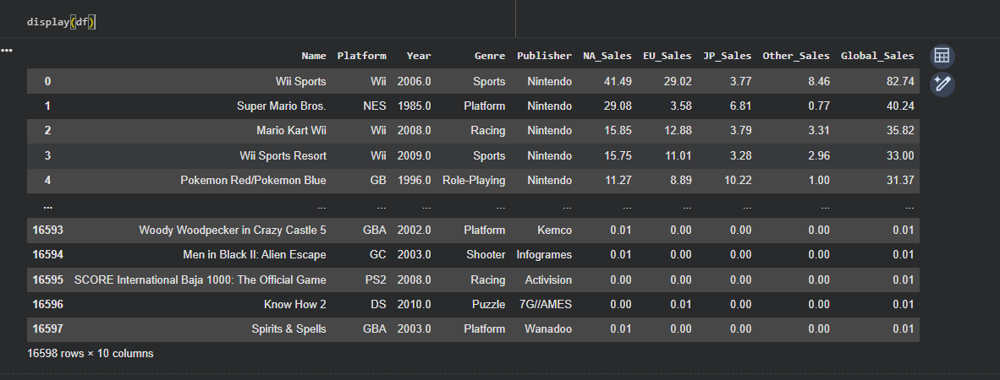

# Final Individual Project for Data Science Fundamentals - Sean T

## Introduction

The purpose of this project was to give us expereince with finding, cleaning, querying, and analyzing a dataset to build upon the skills we have learned throughout the semseter. We were tasked with locating a dataset, creating and answering five research questions, applying a machine learning technique, and creating this documentation. After working on my group project, I decided it would be best to continue working with our original data set to explore a few additional questions, those being: 

* What years were the most profitable overall?
* How does this differ between region and how different are the overall levels of profit for those years?
* Can LSTM be used to predict NA Sales (either per game or annual total)?

## Selection of Data

### Dataset Overview

The [dataset](https://www.kaggle.com/datasets/gregorut/videogamesales) I chose to work with was used by my group due our shared interest in the topic and our belief that the amount of numeric data points would make analysis simpler. The reason I chose to continue working with it was due to the fact that I had already spent a good deal of time with it, allowing me to know what I am working with and simplify my workflow. THis dataset contains the following datapoints:

* The Ranking/Index
* The name of the game at said place
* The platform the particular game was released on
* The year of release
* The game's publisher
* The sales for North America (in millions)
* The sales for Europe (in millions)
* The sales for Japan (in millions)
* The sales for all other countries (in millions)
* The global/total sales overall (in millions)

### Dataset Cleaning

While the data was relatively clean, it still had about 2% (roughly 350 datapoints) of missing or N/A data. My group decided our best course of action was to manually correct a solid chunk of these to bring the number of points below 1%. This was a simple process as most of the data missing was either a year of release or a publisher, meaning a quick search and insertion of data could fix the data. For the purposes of this individual project I did not do much in terms of extra cleaning, but instead decided to drop all data before 1980 and after 2016. The data outside of this timeframe is far more error prone, both from before 1980 having not many entries and missing a year and 2016 missing a huge amount of yearly entries due to the newness of many of the games at the time of this dataset's creation. 

### Data Oddities

As mentioned in the previous section, some oddities occur outside of the timeframe of 1980-2016. Large amounts of missing data (in terms of popular releases not catalogued), a few years without any entries at all, and far too few datapoints to be regarded. By dropping these, I am able to work with the bulk of the data rather than find ways to make these years work.

## Methods

### Packages

* Pandas
* Numpy
* Matplotlib
* Seaborn
* Sklearn
* LSTM
  

### Charting/Machine Learning Applied

* Bar Chart
* Line Plot
* LSTM Modeling
  

### Specific Analysis Features

To make work on our group project easier, I set up a number of testing frames to make the workflow a bit easier and see examples on how to set future frames up should I forget. These frames and the initial set up of the dataset were coppied over to my individual project space to allow for the same.

## Results

The following is what I found while working on my questions

### Question 1: What years were the most profitable overall?

I decided the best way to view the this question was to split it into two: What were the top 5 years in terms of sales and where they fit into the data overall. To do this I set up two very simple frames branching off of the year_sales frame shown in the features section.

Using these charts, I plotted out both the chart of sales over the years and the top 5 sales years.

Looking into this data, it is fairly understandable why the charts look the way they do. The top years all coencided with at least 1 major release in the top 20 overall, such as 2006 hosting Wii Sports. 

Whats intersesting is that the top 3 best selling games for these years contain at least on Nintendo game. Even more intersting is that the years made up of entirely top selling Nintendo games, containing the most number of top 20 best selling games overall, do not place the highest. 2006 containes the top selling game overall, Wii sports with 82.72 million in sales, yet solidly places in the 5th slot for overall yearly sales. I believe this best shows that because of the massive number of games releasing during these years, outliers do not determine a year's individual success. Consistant sales across the year likely have far more impact than a few massive ones. 

### Question 2: How does this differ between region and how different are the overall levels of profit for those years?

To start, I once again decided to split this question into two: see how things look overall then how they breakdown by region. First I set up the neccessary frames by finding the yearly sum for each reigon.

After plotting them on a single chart, they look something like this.

Already we see a few things. Compared to my group project's findings, we can see that even though NA tends to sell the most on average, in the earlier years they traded the top place with JP several times. After 1995 however, NA remains consistantly on top, only dipping as the data becomes less consistant. EU shoots up similarly around this time, leaving JP and other countries grappling back and forth. While this may seem like video game sales in Japan lessen over time, it is important to not that the other 3 regions make up signifigantly more than Japan. NA accounts for all of North America, EU accounts for all of Europe and Other accounts for the rest of the world. Understanding that, Japan's sale numbers are facinating as they show how a single country is able to sell similarly to full regions.

After plotting the chart above I decided to see how the years broke down per sale region. To do this I first sorted each frame made above by their respective sales rather than year and pulled the top 5 datapoints from each. 

After plotting this data it looked like this.

